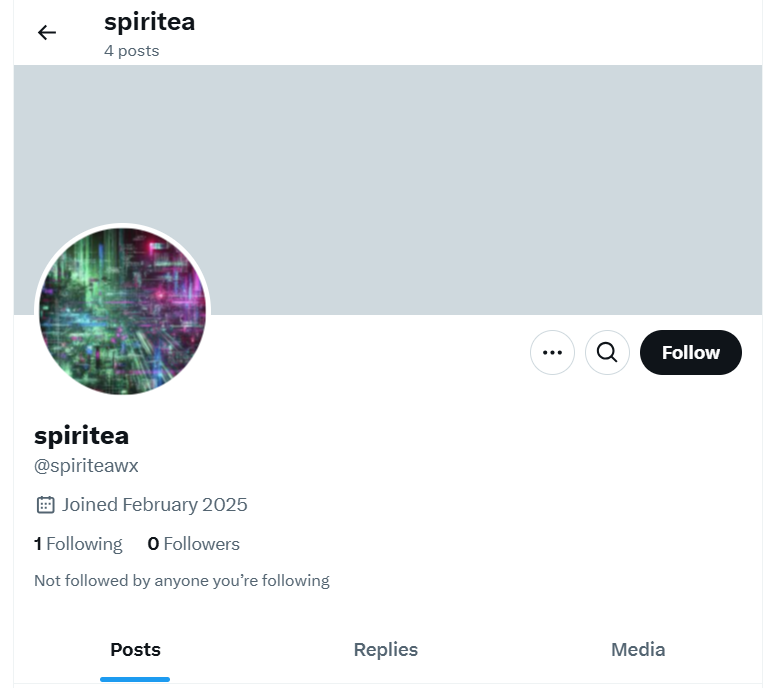
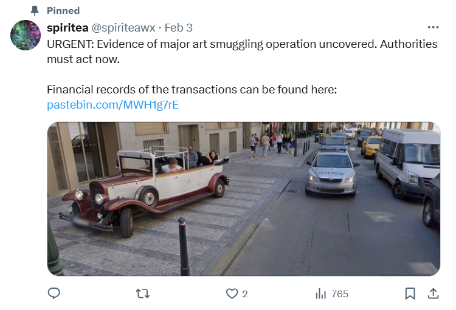
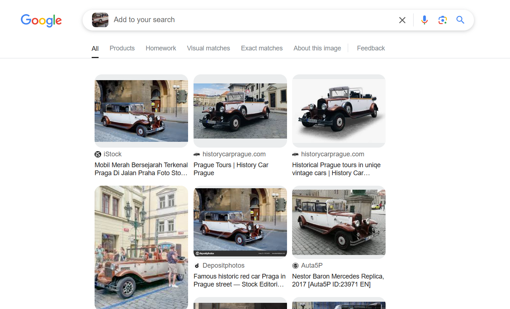
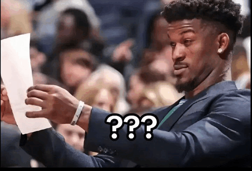
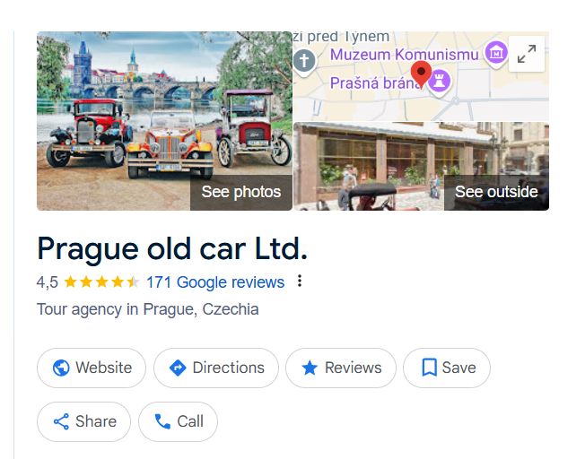
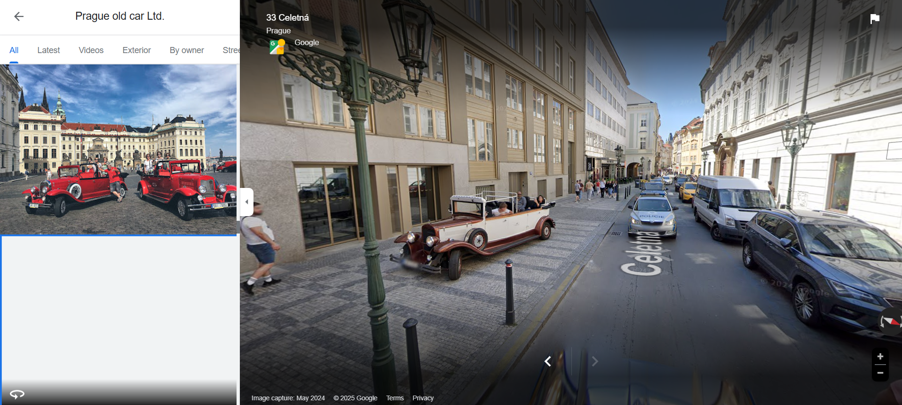
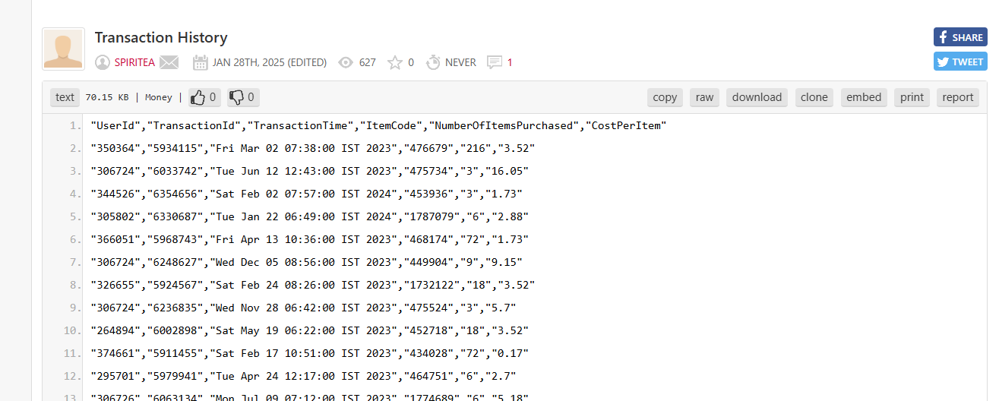
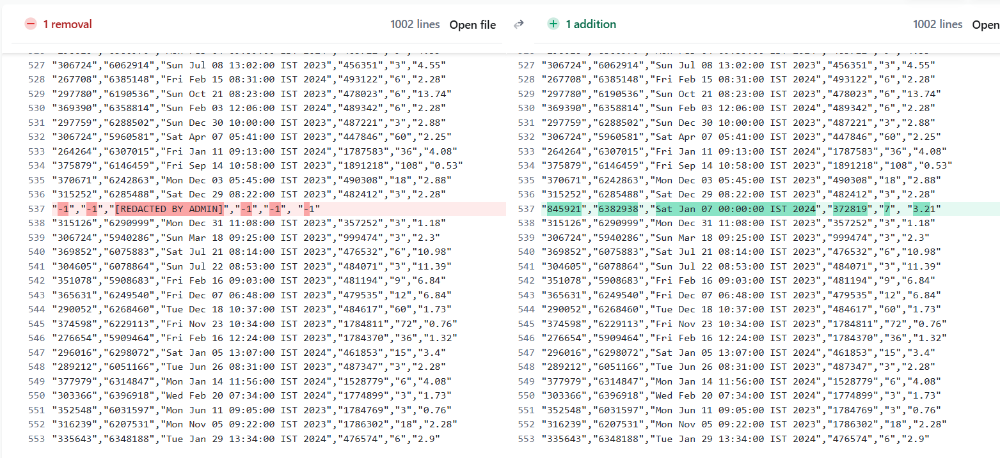
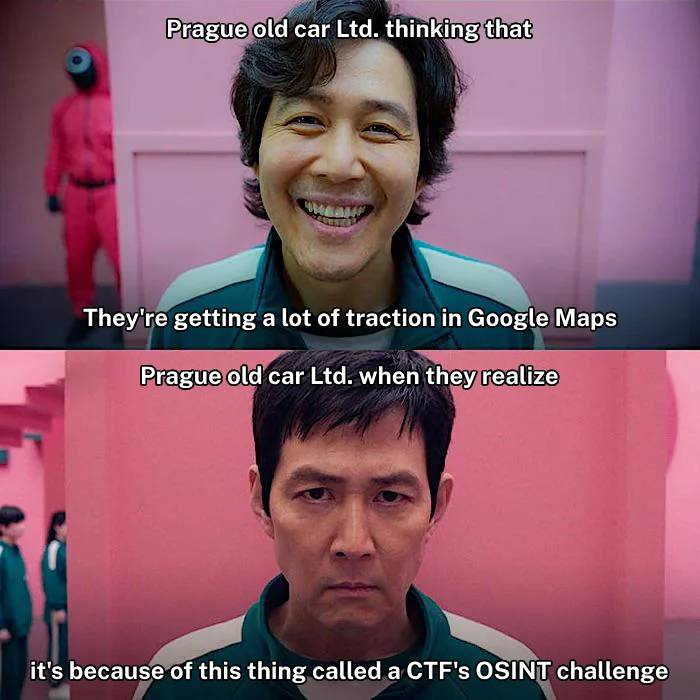

# 

## Description

A whistleblower going by the pseudonym "spiriteawx" has exposed a major art smuggling operation, leaking critical financial documents and leaving cryptic clues. Your mission: Uncover the location of the smuggling activities and identify the associated transaction. Flag Format: pearl{street-name_transaction-id} Note: Strip special characters (e.g., accents) from the street name when entering the flag. (If necessary)

## Points

150 points

## Solving Steps

### Step 1 (Searching for the username)

From my expirience, when an OSINT question uses a username in the description, it almost always means that you need to search for a freshly made account that you can't search up on Google directly. Other than that, most times the username is an account in Twitter. So that's what I did first by searching up: 

`https://x.com/spiriteawx`

### Step 2 (Analyzing the Twitter account)

There are a total of 4 posts from the account and all of them have one thing in common and that's the fact that they're all about admin talking about Czech Republic. More specifically its capital, Prague. From the 4 posts, only one of them is pinned so I assumed that the post holds the most significance in solving for the flag.

### Step 2 (Analyzing the pinned post)

There are two aspects of the post that hold crucial clues. A picture of a location and a pastebin URL.

`https://pastebin.com/MWH1g7rE`

As usual, in an OSINT challenge, the first thing I did and the first thing I think people should do in OSINT challenges like these is using Google Lens or Google Images to reverse search the image. Doing this to the given image in the post will result in a lot of links talking about Historical Prague Car Tours (This was a very big hint but I didn't knew it at the time)

### Step 3 (Confusion)

After going to a few of the links from the Google search, I concluded that all of them weren't useful information for me to find the location in the image given (which it isn't) and I instead searched up famous street locations in Prague and searching each street using Google Maps trying to find the exact location in the image. As expected, this method is innefective and I couldn't find the street location. Here is a image that represents my state during these trying times:

### Step 4 (Realization)

It then hit me (like an old vintage Prague car) that this car, like mentioned before, is from a car tour located in Prague. So I search up vintage car tours located in Prague.... and there it is.... the answer I've been searching for right in front of my very eyes...

I finally got it, the street name. It's name is Celetna. Now all I need to do is fine the transaction ID.

### Step 5 (Finding the transaction ID)

I assumed the transaction ID would be in the pastebin URL given and turns out it is. Opening this link will lead you to a pastebin post of a txt file named Transaction History made by the user SPIRITEA.

This txt file has a total of 1002 lines containing informations such as user IDs, transaction IDs, transaction time, etc. While scrolling to the bottom of the post to see how many lines it has, I stumbled upon a comment from ARMOREDVORTEX (which is the name of one of the authors for Pearl CTF) which says: "It was there. I swear!". This made me think that the pastebin might have been edited and my speculations were true when I scrolled back up and saw that the post had indeed been edited.
 

Using the wayback machine, I was able to get a hold of the exact URL before it was edited. I confirmed that something had been deleted because the URL in the wayback machine told me that the txt file had 70.17 KB which is a difference of 0.02 KB from the current version of the URL. But, since there's literally more than a thousand lines in the txt file, it would take a very long time for a human like me to figure out which line had been deleted. So I tried to find a text comparer online to help me find which line is missing.

`https://www.diffchecker.com/`

Using the wayback machine, I was able to get a hold of the exact URL before it was edited. I confirmed that something had been deleted because the URL in the wayback machine told me that the txt file had 70.17 KB which is a difference of 0.02 KB from the current version of the URL. But, since there's literally more than a thousand lines in the txt file, it would take a very long time for a human like me to figure out which line had been deleted. So I tried to find a text comparer online to help me find which line is missing.

### Step 6 (Forming the flag)

From all the information that I got, I finally formed the flag: <b>pearl{celetna_6382938}</b> and it is correct.

## Red Herrings

While doing this challenge, I ecnountered many dead ends and things that I thought were crucial information but turns out it wasn't and isn't realted to the challenge at all. These red herrings were:
 

1. <b>The three other posts in the Twitter account.</b> I thought they would mean something but turns out it didn't and I spent a good hour trying to decode and read between the lines of the posts. It got to the point where I even analyzed the statues on Charles Bridge thinking that it meant something in the challenge
 

2. <b>ARMOREDVORTEX's pastebin account.</b> I thought that maybe there was hidden clues in his account, so I went to some posts he's made that got significantly more views than the others. Turns out it's probably just his personal work/projects.

## What I learned from this challenge

From this challenge, I learned that sometimes clues are quite obvious and not subliminal at the first place. If I had payed attention to what kinds of services the vintage car is used for in Prague then I probably would've completed the challenge way sooner and saved me a good hour of my time.

