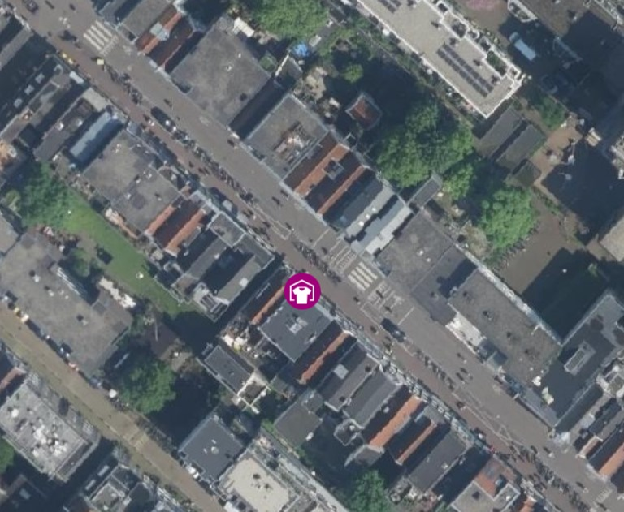
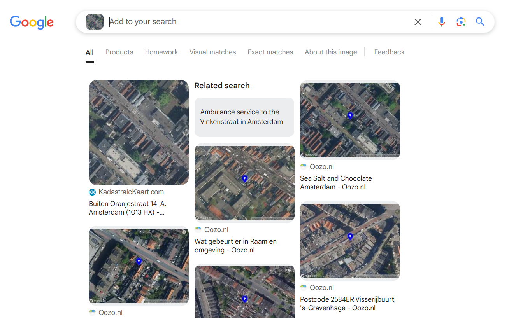
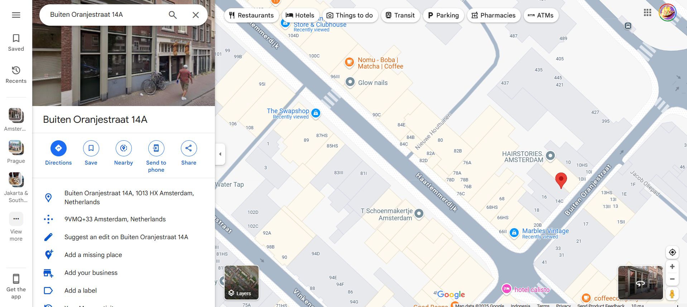

# 

## Description

Helga, a maid at Mr.X's mansion, mistakenly gave away his gold jewelery to some textile collection point along with a pile of old clothes thinking they were GARBAGE. She doesn’t remember which one though! Can someone get me a MAP please? <b>pearl{name_of_the_shop}</b>

## Attachments

[vangogh.zip](additional-files/vangogh.zip)

## Points

100 points

## Solving Steps

### Step 1 (Downloading the zip file)

Fun fact: <b>I was the first blood for this challenge</b>. Anyways, after downloading and extracting the zip file, we get a jpeg. I honestly don't even know why the author used a zip file to store a jpeg but it doesn't matter. As usual, the first thing you want to do when given a picture is to Google Lens it. Doing this will result in tons of similar looking pictures

### Step 2 (Finding the location)

After analyzing the first result to see if it matches the challenge picture, I concluded that it in fact did. Clicking the link of the result lead me to a Dutch website called <b>Kadastralekaart</b> that collects and registers administrative and spatial data of properties.

`https://kadastralekaart.com/adres/amsterdam-buiten-oranjestraat-14/0363200000059845` 

This website gave me an address, which is <b>Outside Oranjestraat 14-A</b>. At that time I wasn't sure if it was the correct address since the challenge picture pointed in a different location but I thought it was near enough that a quick Google Maps search wouldn't hurt.

 

The specific place according to the challenge picture is on a clothing store named <b>The Swapshop</b> and after doing a quick background check on what the store is, it matches the description of this challenge. That being <b>textile collection point</b>. Therefore the flag we're looking for is is: <b>pearl{the_swapshop}</b>

## Red Herrings

When given the current description of the challenge, it seems obvious what the flag is. But keep in mind that when I first solved this challenge there was <b>NO OTHER INFORMATION</b> about what the flag is or would look like. Which was why for a while people weren't able to solve this challenge. In fact, it took me quite some time to figure out what the author wants us to do for this challenge.
 

I concluded that since this challenge only allows players 50 attempts to solve the flag that the flag must be the name of the location. Turns out it is. If it wasn't for my instincts I would've probably been analyzing every single word in the description trying to make out what it could possibly mean.

## What I learned from this challenge

From this challenge, I learned to trust my instincts and to take caclulated risks, especially if the author takes too long to respond to your ticket to the point where you first blooded the challenge even before you get a response...

